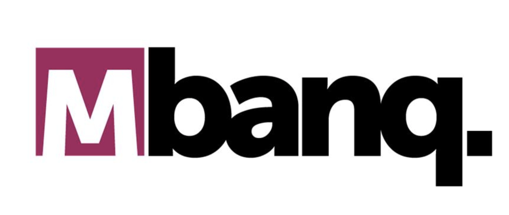

# ISO20022 Message Generator

A Python library for generating ISO20022 compliant financial messages, with a focus on FedWire Funds Service compatibility.

## Features

- Generate ISO20022 compliant XML messages
- Support for pacs.008 (FIToFICstmrCdtTrf) message type
- Support for pacs.028 (FIToFIPmtStsRq) message type
- Generate Fedwire ISO20022 compliant XML messages
- Automatic handling of namespaces and XML structure
- Clean XML output with no empty optional fields
- Support for both AppHdr and Document components

## Installation

```bash
# Clone the repository
git clone https://github.com/yourusername/iso20022.git
cd iso20022

# Install in development mode
pip install -e .
```

## FedWire Messages

### Command Line Interface

The package provides a command-line interface for generating ISO20022 messages:

```bash
# Generate a message structure for a specific message code
python fedwire_message_generator.py urn:iso:std:iso:20022:tech:xsd:pacs.008.001.08

# Generate a complete message using a sample payload
python fedwire_message_generator.py urn:iso:std:iso:20022:tech:xsd:pacs.008.001.08 --generate

# Specify a custom XSD file
python fedwire_message_generator.py urn:iso:std:iso:20022:tech:xsd:pacs.008.001.08 --xsd-file path/to/custom.xsd

# Specify a custom sample payload file
python fedwire_message_generator.py urn:iso:std:iso:20022:tech:xsd:pacs.008.001.08 --generate --sample-file path/to/payload.json

# Specify an output file
python fedwire_message_generator.py urn:iso:std:iso:20022:tech:xsd:pacs.008.001.08 --generate --output-file output.xml
```

### Python

You can also use the library programmatically in your Python code:

```python
import json
from dough.iso20022.fedwire import generate_fedwire_message

# Load your payment data
with open("sample_files/sample_payload.json", "r") as f:
    payload = json.load(f)

# Specify the message code and XSD path
message_code = "urn:iso:std:iso:20022:tech:xsd:pacs.008.001.08"
xsd_path = "proprietary_xsd/fedwirefunds-incoming.xsd"

# Generate the message
app_hdr_xml, document_xml, complete_message = generate_fedwire_message(message_code, payload, xsd_path)

# Save to file
with open("output.xml", "w") as f:
    f.write(complete_message)
```

### Web Application

The easiest way to generate ISO20022 messages is through the web application:

```bash
# Install the package with web application dependencies
pip install -e .[webapp]

# Run the web application
python run_webapp.py
```

This will start a web server at http://localhost:8888 where you can:
1. Select a message type from the dropdown menu
2. Upload a proprietary XSD file
3. Enter or upload a JSON payload
4. Generate and download the ISO20022 message

### Supported Message Types

The library currently supports the following message types:

- **pacs.008.001.08** - Customer Credit Transfer
  - Full support with complete model class and validation
  
- **pacs.028.001.03** - Payment Status Request
  - Full support with complete model class and validation

### Sample Payload Format

Your input JSON should follow this structure:

```json
{
  "fedWireMessage": {
    "inputMessageAccountabilityData": {
      "inputCycleDate": "20250109",
      "inputSource": "MBANQ",
      "inputSequenceNumber": "001000001"
    },
    "amount": {
      "amount": "1000",
      "currency": "USD"
    }
    // ... other payment details
  }
}
```

## Key Features

- **Clean XML Output**: The library automatically removes empty optional fields from the XML output, ensuring clean and valid ISO20022 messages.
- **Namespace Handling**: Proper namespace prefixing and declarations are automatically managed.
- **Type Safety**: Uses Python dataclasses for type safety and validation.
- **Extensible**: Easy to add support for additional ISO20022 message types.

## Development

Generate a sample file:

```bash
python generate_sample_payment_file.py
```

## Web Application

The project includes a web application that allows you to generate ISO20022 messages through a user-friendly interface:

1. Install the package with web application dependencies:
   ```bash
   pip install -e .[webapp]
   ```

2. Run the web application using the provided script:
   ```bash
   python run_webapp.py
   ```

3. Open your browser and navigate to http://localhost:8888

The web application allows you to:
- Upload a proprietary XSD file
- Enter or upload a JSON payload
- Select a message type from the dropdown
- Generate and download ISO20022 messages

## Important Notice on Proprietary Envelope

The Fedwire envelope format is proprietary and must be implemented according to the Federal Reserve specifications. This library only generates the ISO 20022 message content (AppHdr and Document) that goes inside the envelope.

For official information about Fedwire ISO 20022 implementation, including envelope specifications, please consult:
- [Federal Reserve ISO 20022 Implementation Center](https://www.frbservices.org/resources/financial-services/wires/iso-20022-implementation-center)
- Federal Reserve's MyStandards platform (requires registration)
- The Fedwire Funds Service ISO 20022 Implementation Guide


## License

This project is licensed under the MIT License - see the LICENSE file for details.

<p align="center"></p>


<p align="center"><strong style="font-size: 2em">Built with :heart: in the Beautiful State of Washington!</strong></p>
